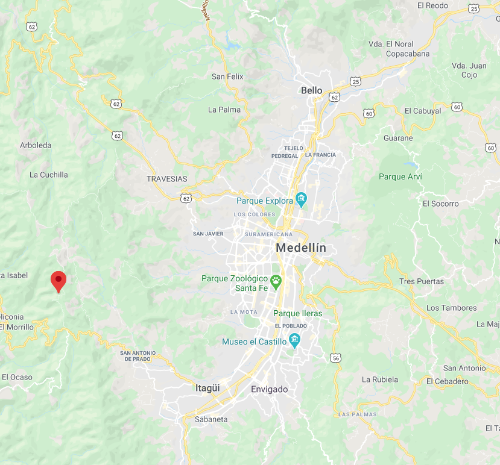

```{r setup, include=FALSE}
knitr::opts_chunk$set(echo = TRUE)
```

```{r,echo = FALSE,warning=FALSE, message=FALSE, include=TRUE}
library(lubridate)
library(ggmap)
library(MASS)
library(ISLR)
library(dplyr)
library(digest)
library(glue)
library(dummies)
library(factoextra)
library(class)
library(stringr)
library(ggplot2)
library(FNN)
library(rpart)
require(reshape)
library(plotly)
library(caret)
library(lattice)
library(tidyverse)
library(hrbrthemes)
library(viridis)
library(cluster)
library(leaflet)
library(rgdal)
library(htmltools)
library(mapview)
```

# Introducción

La accidentalidad en la ciudad de Medellín ha estado sectorizada desde hace varios años, por lo cual los entes gubernamentales han recurrido a unir esfuerzos y ubicar estratégicamente personal de tránsito, cámaras de fotodetección, resaltos, semáforos ,entre otros.El presente trabajo pretende presentar las zonas con alta accidentalidad a través del tiempo, resaltando los casos donde se presentan personas lesionadas o fallecimientos, con el fin de que se puedan tomar acciones proactivas en el planteamiento de estrategias de seguridad vial.


# Actividades de ETL

A continuación, se realizará la carga inicial de los datos y el pre-procesamiento inicial de los mismos. Los datos empleados en este trabajo son diferentes a los que se encuentran en la página web de datos abiertos de movilidad, dado que se tuvo la oportunidad de hablar directamente con la persona encargada del mantenimiento de las bases de datos del portal y suministró una base de datos más limpia.

Carga de la base de datos
```{r}
DATA = read.csv(
      file = 'Incidentes2014_2020.csv',
      header = TRUE,
      sep = ";",
      encoding="UTF",
      stringsAsFactors = FALSE
      ) 
colnames(DATA)<-c("NRO_RADICADO","Latitud","Longitud","CLASE_ACCIDENTE","DIRECCION","CBML","Gravedad Incidente", "nombre comuna",	"Barrio","Diseño","Año","FECHA_ACCIDENTE","HORA_ACCIDENTE","codigo.comuna","COMUNA")
DATA<-DATA[DATA$Año<=2018,]
```

Carga de archivo auxiliar para unificar el nombre de los barrios
```{r}
BARRIO = read.csv(
      file = 'BARRIOS_NUEVOS.csv',
      header = TRUE,
      sep = ";",
      encoding="UTF",
      stringsAsFactors = FALSE
) #Tabla auxiliar para unificar el nombre de los BARRIOS
```

Eliminación de variables que no se utilizarán
```{r}
DATA= select(DATA,-NRO_RADICADO, -DIRECCION, -CBML,-"nombre comuna", -codigo.comuna)
```

Modificación del nombre las variables 
```{r}
names(DATA)= c("LATITUD", "LONGITUD", "CLASE", "GRAVEDAD", "BARRIO", "DISEÑO", "ANO", "FECHA", "HORA.ACC","COMUNA")
```

Unificación de la variable barrios 
```{r}
for(i in BARRIO$NOMBRE){
  DATA$BARRIO[DATA$BARRIO == i] = BARRIO$BARRIO[BARRIO$NOMBRE == i]
}
```

```{r}
DATA = DATA[DATA$COMUNA != "",]
```
Modificación de la variable gravedad
```{r}
DATA$GRAVEDAD[grep("Con heridos",DATA$GRAVEDAD)] = "HERIDO"
DATA$GRAVEDAD[grep("Con muertos",DATA$GRAVEDAD)] = "MUERTO"
DATA$GRAVEDAD[grep("Con Muertos",DATA$GRAVEDAD)] = "MUERTO"
DATA$GRAVEDAD[grep("Solo daños",DATA$GRAVEDAD)] = "SOLO DAÑOS"
```

```{r, echo=FALSE}
DATA$CANTIDAD = 1 #Asignandole a cada observación el valor de 1, indicando que es 1 accidente
DATA$GRAVEDAD = factor(DATA$GRAVEDAD) #Volviendo factor la variable
DATA$CLASE= factor(DATA$CLASE) #Volviendo factor la variable
DATA$FECHA = as.Date(DATA$FECHA,format = "%d/%m/%Y") #Volviendo fecha la variable
DATA$HORA = as.numeric(substr(DATA$HORA.ACC,1,2)) #Extrayendo la hora del suceso 0, ..., 23
rm(BARRIO,i)
```
Para los datos que no cuentan con información del barrio en el que ocurrió el incidente, esta información será imputada para no borrar los datos. Para esto, se usará un algoritmo de $KNN$ con $K = 1$ teniendo como covariables la ```LATITUD``` y ```LONGITUD```, obteniendo así la asignación del incidente más cercano que si tiene en su información el nombre del barrio en que ocurrió. Este mismo procedimiento se llevará a cabo para imputar las comunas que aparecen sin información. 

```{r}
DATA_TRAIN = DATA[-which(is.na(DATA$LATITUD)),c("LATITUD","LONGITUD","BARRIO")]
DATA_TRAIN$BARRIO = as.character(DATA_TRAIN$BARRIO)
BARRIO_PREDICHO = knn(train = DATA_TRAIN[DATA_TRAIN$BARRIO != "SN",c("LATITUD","LONGITUD")],
                      test = DATA_TRAIN[DATA_TRAIN$BARRIO == "SN",c("LATITUD","LONGITUD")],
                      cl = DATA_TRAIN[DATA_TRAIN$BARRIO != "SN","BARRIO"],
                      k = 1) 
# Entrenamiento del KNN con K=1 para asignar el nombre del BARRIO más cercano a los datos que no lo tienen

DATA_TRAIN$BARRIO[DATA_TRAIN$BARRIO == "SN"] = as.character(BARRIO_PREDICHO) 
#Asignación de BARRIOs corregidos
DATA_TRAIN = DATA_TRAIN[DATA_TRAIN$LATITUD != DATA_TRAIN$LATITUD[11] & DATA_TRAIN$LONGITUD != DATA_TRAIN$LONGITUD[11],] 
#Eliminación de los datos que están con georeferenciación errónea
DATA$BARRIO[as.numeric(row.names(DATA_TRAIN))] = DATA_TRAIN$BARRIO 
rm(DATA_TRAIN,BARRIO_PREDICHO)

# Entrenamiento del KNN con K=1 para asignar el nombre de la comuna más cercana a los datos que no lo tienen
DATA = DATA[-which(is.na(DATA)),]
DATA$COMUNA = as.factor(DATA$COMUNA)
rownames(DATA) = 1:length(DATA$LATITUD)
TRAIN = DATA[DATA$COMUNA != "Sin Inf",c("LATITUD","LONGITUD","COMUNA")]

TEST = DATA[DATA$COMUNA == "Sin Inf",c("LATITUD","LONGITUD")]

COMUNA_PREDICHO = knn(train = TRAIN[,c("LATITUD","LONGITUD")],
                      test = TEST,
                      cl = TRAIN$COMUNA,
                      k = 1)


DATA$COMUNA[as.numeric(row.names(TEST))] = COMUNA_PREDICHO
DATA$COMUNA_BARRIO = paste(DATA$COMUNA,DATA$BARRIO,sep="+")

rm(COMUNA_PREDICHO,TRAIN,TEST)
```

Analizando los datos de georeferenciación, se encuentra un dato que suponemos erróneo dado su ubicación y la gran cantidad de accidentes asociados al mismo punto



En dicho punto, se encontraron 16.024 incidentes asociados en el dataset que se usará para el agrupamiento. Como se explicó detalladamente en el informe técnico de predicción, se intentó realizar una estimación usando la API de Google Maps pero no se lograron encontrar muchas coincidencias, por lo que se decide excluir estas observaciones, que representan el 7.04% de las observaciones.

```{r,echo=FALSE}
DATA = DATA[DATA$BARRIO != "SN",]

```

Se corrigen la combinación de comunas y barrios de acuerdo al archivo de georeferencia

```{r}
#
DATA_MAPA = readOGR("OPENDATA_Catastro_CTM12.geojson",use_iconv = TRUE, encoding = "UTF-8")
DATA_MAPA@data$COMUNA_BARRIO = paste(DATA_MAPA@data$NOMBRE_COMUNA,DATA_MAPA@data$NOMBRE_BARRIO,sep="+")
```

```{r}
verdaderos = DATA_MAPA@data$COMUNA_BARRIO
totales = unique(DATA$COMUNA_BARRIO)
lista_buenos = c()
lista_malos = c()
for(i in totales){
  
  if(i %in% verdaderos){
    
    lista_buenos = c(lista_buenos,i)
    
  } else {
    
    lista_malos = c(lista_malos,i)
    
  }
  
}

```

```{r}
DATA$BARRIO = as.factor(DATA$BARRIO)
DATA$COMUNA = as.factor(DATA$COMUNA)
TEST = DATA[DATA$COMUNA_BARRIO %in% lista_malos,c("LATITUD","LONGITUD")]
TRAIN = DATA[DATA$COMUNA_BARRIO %in% lista_buenos,c("LATITUD","LONGITUD","BARRIO","COMUNA")]

ARREGLO_BARRIOS = knn(train = TRAIN[,c("LATITUD","LONGITUD")],
                      test = TEST,
                      cl = TRAIN$BARRIO,
                      k = 1)

ARREGLO_COMUNAS = knn(train = TRAIN[,c("LATITUD","LONGITUD")],
                      test = TEST,
                      cl = TRAIN$COMUNA,
                      k = 1)

DATA$BARRIO[DATA$COMUNA_BARRIO %in% lista_malos] = (ARREGLO_BARRIOS)
DATA$COMUNA[DATA$COMUNA_BARRIO %in% lista_malos] = (ARREGLO_COMUNAS)
DATA$COMUNA_BARRIO = paste(DATA$BARRIO,DATA$COMUNA,sep="+")

rm(TEST,TRAIN,ARREGLO_BARRIOS,ARREGLO_COMUNAS,i,lista_buenos,lista_malos,totales,verdaderos)
datos<-DATA
rm(DATA)
```


Carga de archivos auxiliares que contienen los festivos
```{r}
#Lectura de los archivos de Festivos
FESTIVOS_OTROS = read.csv(
      file = 'FESTIVOS_OTROS.csv',
      header = TRUE,
      sep = ";")

FESTIVOS_FIJO = read.csv(
      file = 'FESTIVOS_FIJOS.csv',
      header = TRUE,
      sep = ";") #Carga de tabla auxiliar para saber si el día es festivo no fijo en Colombia
```

Configuración de variables de tiempo
Creación de algunas variables de apoyo para las variables de agrupamiento + Inclusión análisis de días festivos
```{r}
#calculos varios para sacar dias respecto al mes, al año, a la semana y demás
datos$DIA_MES=mday(datos$FECHA)
#datos$DIA_ANO=yday(datos$FECHA)
datos$DIA_SEMANA=wday(datos$FECHA)
datos$MESN=month(datos$FECHA)
#datos$ANO=year(datos$FECHA)
datos$DIA_NOMBRE=wday(datos$FECHA,label = TRUE)
datos$DIA_NOMBRE=substring(datos$DIA_NOMBRE,1,3)
datos$FESTIVO=0
```

Definición de variable festivo 
```{r}
#Se actualiza la variable festivo, si es 1 es porque es festivo, 0 si no
for(i in 1:nrow(FESTIVOS_FIJO)){
  datos$FESTIVO[(datos$DIA_MES == FESTIVOS_FIJO$DIA[i]) 
                & (datos$MESN == FESTIVOS_FIJO$MES[i])]=1
}

for(i in 1:nrow(FESTIVOS_OTROS)){
  datos$FESTIVO[(datos$DIA_MES == FESTIVOS_OTROS$DIA[i]) & 
                  (datos$MESN == FESTIVOS_OTROS$MES[i]) &
                  (datos$ANO == FESTIVOS_OTROS$ANO[i])]=1
}
rm(i)
```

Verificación de la carga de festivos. Deben haber 90 festivos, 18 por cada año
```{r}
Fest=subset(datos, datos$FESTIVO==1, c("FECHA", "FESTIVO"))
length(unique(Fest$FECHA))
rm(Fest)
```

```{r}
#Usando la variable festivo y el día de la semana identificamos los viernes y lunes festivos (puente festivo)
datos$DIA_PUENTE<-with(datos,ifelse(datos$DIA_SEMANA %in% c(2,6) & datos$FESTIVO==1,1,0))

#Dataframe con todas las observaciones en viernes festivo
df_aux<-subset(datos,datos$DIA_SEMANA==6 & datos$FESTIVO==1)
#Lista de fechas de viernes festivos
fechas_vf=as.data.frame(unique(df_aux$FECHA))
fechas_javf=as.data.frame(unique(df_aux$FECHA))
#Se crea la columna para cargar los jueves antes de día festivo
datos$JUEVES_F=0

#Se crea la lista de las fechas de los jueves antes de viernes festivo
for(i in 1:nrow(fechas_vf)){
fechas_javf[i,1]=fechas_vf[i,1]-1  
}

#Se pone 1 en la columna de JUEVES_F, para aquellas observaciones que ocurren los jueves antes de viernes festivo
for(i in 1:nrow(fechas_javf)){
datos$JUEVES_F[datos$FECHA==fechas_javf[i,1]]=1  
}
rm(i,df_aux,fechas_vf,fechas_javf)
```

```{r}
#Variable que pone 1 si es un jueves cuyo viernes es festivo y también la variable para el caso de los domingos cuyo lunes es festivo(se usan en las variables de fin de semana)
#Jueves
#Dataframe con todas las observaciones en lunes festivo
df_aux1<-subset(datos,datos$DIA_SEMANA==2 & datos$FESTIVO==1)
#Lista de fechas de lunes festivos
fechas_lf=as.data.frame(unique(df_aux1$FECHA))
fechas_dalf=as.data.frame(unique(df_aux1$FECHA))
#Se crea la columna para los domingos antes de lunes festivo
datos$DOMINGO_AF=0
#Se crea la lista de los domingos antes de lunes festivo
for(i in 1:nrow(fechas_lf)){
fechas_dalf[i,1]=fechas_lf[i,1]-1  
}
#Se pone 1 en la columna de DOMINGO_AF, para aquellas observaciones que ocurren los domingos antes de lunes festivo
for(i in 1:nrow(fechas_dalf)){
datos$DOMINGO_AF[datos$FECHA==fechas_dalf[i,1]]=1  
}
rm(i, df_aux1,fechas_lf, fechas_dalf)
```

## Definición de variables de agrupamiento

A continuación se realizará la creación de algunas variables que se sospecha puedan influir en el comportamiento y agrupamiento de la accidentalidad en la ciudad de Medellín.

Variables según gravedad y fin de semana
```{r}
#Con la variable gravedad se crea la variable gravedad_humano, que representa si el accidente dejo muerto o herido
datos$GRAVEDAD_HUMANO<-with(datos,ifelse(datos$GRAVEDAD %in% c("HERIDO","MUERTO"),1,0))
datos$SOLO_DANOS<-with(datos,ifelse(datos$GRAVEDAD %in% c("SOLO DAÑOS"),1,0))
#Variable que indica si es fin de semana
datos$FDS_TOTAL<-with(datos, ifelse(datos$DIA_SEMANA %in% c(1,7),1,ifelse(datos$DIA_PUENTE==1,1,0)))

#Variable para los festivos entre semana 
datos$FESTIVO_EN_SEMANA=with(datos,ifelse(datos$DIA_SEMANA %in% c(3,4,5)&datos$FESTIVO==1,1,0))

#Variable para obtener accidentes dentro de la semana total
datos$DIA_LABORAL=with(datos,ifelse(datos$DIA_SEMANA %in% c(2,3,4,5,6)&datos$FESTIVO==0,1,0))
```

Variables para el fin de semana en la noche
```{r}
#Variable que pondrá 1 si es fin de semana (viernes o sábado y los casos de los festivos en los horarios determinados) de 8pm a 4 am
datos$FDS_NOCHE<-with(datos,ifelse(datos$DIA_PUENTE==1&datos$DIA_SEMANA==6&(datos$HORA<4|datos$HORA>20),1,ifelse(datos$FESTIVO==0&datos$DIA_SEMANA==6&datos$HORA>20,1,ifelse(datos$DIA_SEMANA==7&(datos$HORA>20|datos$HORA<4),1,ifelse(datos$LUNES_F==1&(datos$HORA>20|datos$HORA<4),1,ifelse(datos$LUNES_F==0&datos$DIA_SEMANA==1&datos$HORA<4,1,ifelse(datos$DIA_PUENTE==1&datos$DIA_SEMANA==2&datos$HORA<4,1,0)))))))

#Variable para obtener los horarios nocturnos entre semana
datos$EntreS_n<-with(datos,ifelse(datos$DIA_LABORAL==1&datos$DIA_SEMANA!=6&(datos$HORA>20|datos$HORA<4),1,ifelse(datos$DIA_LABORAL==1&datos$DIA_SEMANA==6&datos$HORA<4,1,0)))

#Variable para diferenciar si es noche de semana o fin de semana
datos$nocturno<-with(datos,ifelse(datos$EntreS_n==1,"Noche en Semana",ifelse(datos$FDS_NOCHE==1,"Noche Fin de semana","N/A")))

```
Variables de hora pico
```{r}
#Variable categórica para obtener las 2 secciones del día de horas Pico
datos$HORA_PICO1<-with(datos,ifelse(datos$DIA_LABORAL==1&datos$HORA>=6&datos$HORA<9,"HORA PICO AM",ifelse(datos$DIA_LABORAL==1&datos$HORA>=16&datos$HORA<19,"HORA PICO PM","HORA NORMAL")))

#Variable de horas pico por franja horaria
datos$HORA_PICO_MANANA<-with(datos,ifelse(datos$HORA_PICO1 %in% c("HORA PICO AM"),1,0))
datos$HORA_PICO_TARDE<-with(datos,ifelse(datos$HORA_PICO1 %in% c("HORA PICO PM"),1,0))
datos$HORA_PICO_GENERAL<-with(datos,ifelse(datos$HORA_PICO1 %in% c("HORA PICO AM","HORA PICO PM"),1,0))
#Variable para diferencia que tipo de dia es, si laborable, si finde o festivo en semana
datos$cat_dia<-with(datos,ifelse(datos$DIA_LABORAL==1,"Dia Laboral",ifelse(datos$FDS_TOTAL==1,"Fin de semana","Festivo en semana")))
#Indicador diferenciador entre las horas pico y las normales
datos$Hora_pico=with(datos,ifelse(datos$HORA_PICO_GENERAL==1,"Hora Pico","Hora Normal"))
datos$HORAPICO_GRAVEDAD=with(datos,ifelse(datos$HORA_PICO_GENERAL==1 & datos$GRAVEDAD_HUMANO ==1, 1, 0))
datos$HORAPICO_DANOS=with(datos,ifelse(datos$HORA_PICO_GENERAL==1 & datos$SOLO_DANOS ==1, 1, 0))
rm(FESTIVOS_FIJO,FESTIVOS_OTROS)
```

# Análisis exploratorio

El análisis exploratorio se realiza con el objetivo de encontrar las variables que realmente son significativas a la accidentalidad, generando un valor agregado al objetivo de estudio.

## Analisis de accidentes totales

Análisis por cantidades totales de accidentes. 

### Análisis por tipo de día: dia laboral, festivo entre semana y fin de semana
```{r}
datosTD<-aggregate(cbind(CANTIDAD)~FECHA+cat_dia,data=datos,FUN=sum)
#datosTD
boxplot <- ggplot(datosTD, aes(x = cat_dia, y = CANTIDAD, fill=cat_dia)) +
  geom_boxplot()+
  geom_jitter(color="black", size=0.2, alpha=0.9) +
  theme(legend.position="none") +
  ggtitle("Boxplot Accidentes por tipo de día") + xlab("") + ylab("Cantidad de accidentes")
ggplotly(boxplot)
rm(datosTD)
```
En el gráfico anterior se puede observar que los días laborales son donde ocurren mayor número de accidentes de tránsito.

### Análisis por día de la semana
```{r}
datoDSF=subset(datos,datos$FESTIVO==0,select=c(CANTIDAD,DIA_NOMBRE,FECHA))
datosD<-aggregate(cbind(CANTIDAD)~FECHA+DIA_NOMBRE,data=datoDSF,FUN=sum)
#datosD
datosD$DIA_NOMBRE <- factor(datosD$DIA_NOMBRE, levels = c('lun', 'mar', 'mié', 'jue', 'vie', 'sáb', 'dom'))
boxplot <- ggplot(datosD, aes(x = as.factor(DIA_NOMBRE), y = CANTIDAD, fill=as.factor(DIA_NOMBRE))) +
        geom_boxplot()+
  theme(legend.position="none")+
  ggtitle("Boxplot Accidentes por dia de la semana") + xlab("Día") + ylab("Cantidad de accidentes")
ggplotly(boxplot)
rm(datoDSF,datosD)
```
En la comparación por día se presenta cierta homogeneidad en los accidentes de los días en semana, sin embargo resalta el viernes como el día con mayor número de accidentes promedio. 

### Análisis por tipo de día y hora
```{r}
datosTD<-subset(datos,datos$cat_dia!="Festivo en semana",select=c(FECHA,HORA,cat_dia,CANTIDAD))
datosDH<-aggregate(cbind(CANTIDAD)~FECHA+HORA+cat_dia,data=datosTD,FUN=sum)
#datosDH
boxplot <- ggplot(datosDH, aes(x = as.factor(HORA), y = CANTIDAD, fill=as.factor(HORA))) +
  geom_boxplot()+
  theme(legend.position="none")+
  ggtitle("Boxplot Accidentes por hora y tipo día")+ xlab("Hora") + ylab("Cantidad de accidentes")+
  facet_grid(cat_dia~.)
ggplotly(boxplot)
rm(datosTD,datosDH)
```
Visualmente el comportamiento de los accidentes es diferente según la hora del día. Para los días laborales se tiene un pico entre las 6am y 9am; y para los fines de semana el pico de accidentes se encuentra al medio día. 

### Análisis por franja de horas en dia laboral (horas pico)
```{r}
datosHoraP<-aggregate(cbind(CANTIDAD)~FECHA+Hora_pico,data=datos,FUN=sum)
datosHoraP$CANTIDAD<-with(datosHoraP,ifelse(datosHoraP$Hora_pico=="Hora Normal",datosHoraP$CANTIDAD/16,datosHoraP$CANTIDAD/6))
#datosHoraP
boxplot <- ggplot(datosHoraP, aes(x = Hora_pico, y = CANTIDAD, fill=Hora_pico))+
  geom_boxplot()+
  theme(legend.position="none")+
  ggtitle("Boxplot Promedio de Accidentes por tipo hora")+ xlab("Tipo Hora") + ylab("Promedio de accidentes")
ggplotly(boxplot)
rm(datosHoraP)
```
Se evidencia que en días laborables y horas pico, existe una diferencia significativa en el número de accidentes vs las horas normales.

### Análisis por horas Pico (AM-PM)
```{r}
datosH<-aggregate(cbind(CANTIDAD)~FECHA+HORA_PICO1,data=datos,FUN=sum)
datosH<-subset(datosH,datosH$HORA_PICO1!="HORA NORMAL",select=c(HORA_PICO1,FECHA,CANTIDAD))
boxplot <- ggplot(datosH, aes(x = HORA_PICO1, y = CANTIDAD, fill=HORA_PICO1)) +
        geom_boxplot()+
  theme(legend.position="none")+
  ggtitle("Boxplot Accidentes por hora pico")+ xlab("Hora Pico") + ylab("Cantidad de accidentes")
ggplotly(boxplot)
rm(datosH)
```
Visualmente no se encuentra que los accidentes en horas pico de la mañana sean diferentes a los accidentes de las horas pico de la tarde.

### Análisis accidentes horas nocturas semama y fin de semana
```{r}
datoN=subset(datos,datos$nocturno!="N/A",select=c(CANTIDAD,nocturno,FECHA))
datosHoraN<-aggregate(cbind(CANTIDAD)~FECHA+nocturno,data=datoN,FUN=sum)
#datosHoraN
boxplot <- ggplot(datosHoraN, aes(x = nocturno, y = CANTIDAD, fill=nocturno)) +
  geom_boxplot()+
  theme(legend.position="none")+
  ggtitle("Boxplot Accidentes nocturnos")+ xlab("Franja nocturna") + ylab("Cantidad de accidentes")
ggplotly(boxplot)
rm(datoN,datosHoraN)
```
Se puede observar que existe mayor número de accidentes en las noches de fin de semana que en las noches de semana.

## Análisis de accidentes según la gravedad humano 

Análisis por cantidades totales de accidentes, según su gravedad.

### Análisis de accidentes totales por gravedad 
```{r}
datosG<-aggregate(cbind(CANTIDAD)~FECHA+GRAVEDAD,data=datos,FUN=sum)
#datosG
boxplot <- ggplot(datosG, aes(x =GRAVEDAD , y = CANTIDAD, fill=GRAVEDAD)) +
  geom_boxplot()+
  theme(legend.position="none")+
  ggtitle("Boxplot Accidentes por tipo de gravedad")+ xlab("Gravedad") + ylab("Cantidad de accidentes")
  ggplotly(boxplot)
rm(datosG)
```
Según la gráfica anterior, en los accidentes de tránsito se presentan más heridos que incidentes por solo daños. 

### Análisis por tipo de día, en accidentes con gravedad de muerto o herido  
```{r}
datosG=subset(datos,datos$GRAVEDAD_HUMANO==1,select=c(CANTIDAD,cat_dia,DIA_NOMBRE,FECHA))
datosG<-aggregate(cbind(CANTIDAD)~FECHA+DIA_NOMBRE+cat_dia,data=datosG,FUN=sum)
#datosG
boxplot <- ggplot(datosG, aes(x = cat_dia, y = CANTIDAD, fill=cat_dia)) +
        geom_boxplot()+
  geom_jitter(color="black", size=0.2, alpha=0.9) +
  theme(legend.position="none") +
  ggtitle("Boxplot Accidentes por tipo de día, con muerto o herido") + xlab("") + ylab("Cantidad de accidentes")
ggplotly(boxplot)
rm(datosG)
```
### Análisis por día de la semana en accidentes con gravedad de muerto o herido
```{r}
datosG=subset(datos,datos$GRAVEDAD_HUMANO==1,select=c(CANTIDAD,DIA_NOMBRE,FECHA))
datosG<-aggregate(cbind(CANTIDAD)~FECHA+DIA_NOMBRE,data=datosG,FUN=sum)
datosG$DIA_NOMBRE <- factor(datosG$DIA_NOMBRE, levels = c('lun', 'mar', 'mié', 'jue', 'vie', 'sáb', 'dom'))
#datosG
boxplot <- ggplot(datosG, aes(x =DIA_NOMBRE, y = CANTIDAD, fill=DIA_NOMBRE)) + geom_boxplot()+
  theme(legend.position="none")+
  ggtitle("Boxplot Accidentes con muerto o herido, por día de la semana")+ xlab("Gravedad") +     ylab("Cantidad de accidentes")
ggplotly(boxplot)
rm(datosG)
```
Visualmente se presenta cierta homogeneidad en los accidentes con heridos o muertos, en los días de semana.

### Análisis por hora de día ordinal y con gravedad de muerto o herido
```{r}
datoH=subset(datos,datos$cat_dia!="Festivo en semana"&datos$GRAVEDAD_HUMANO==1,select=c(CANTIDAD,HORA,Hora_pico,HORA_PICO1,FECHA, cat_dia))
datosHoraP<-aggregate(cbind(CANTIDAD)~FECHA+HORA+Hora_pico+HORA_PICO1+cat_dia,data=datoH,FUN=sum)
#datosHoraP
boxplot<- ggplot(datosHoraP, aes(x = as.factor(HORA), y = CANTIDAD, fill=as.factor(HORA))) +
        geom_boxplot()+
  theme(legend.position="none")+
  ggtitle("Boxplot Accidentes por hora con gravedad de muerto o herido")+ xlab("Hora") +   ylab("Cantidad de accidentes")+
  facet_grid(cat_dia~.)
ggplotly(boxplot)
```
Visualmente el comportamiento de los accidentes donde se presentan muertes y heridos, es diferente según la hora del día. Para los días laborales se tiene un pico entre las 6am y 8am.

### Análisis por horas Pico (AM-PM) de día ordinal y con gravedad de muerto o herido
```{r}
datosHoraP$CANTIDAD<-with(datosHoraP,ifelse(datosHoraP$Hora_pico=="Hora Normal",datosHoraP$CANTIDAD/16,datosHoraP$CANTIDAD/6))
#datosHoraP
boxplot <- ggplot(datosHoraP, aes(x = Hora_pico, y = CANTIDAD, fill=Hora_pico)) +
        geom_boxplot()+
  theme(legend.position="none")+
  ggtitle("Boxplot Promedio de Accidentes por tipo hora con muerto o herido")+ xlab("Tipo Hora") + ylab("Promedio de accidentes")
ggplotly(boxplot)
```

Se evidencia que en días laborables y horas pico, existe una diferencia significativa en el número de accidentes graves vs las horas normales.

### Análisis por horas Pico (AM-PM) con gravedad de muerto o herido
```{r}
datosHoraP<-aggregate(cbind(CANTIDAD)~FECHA+HORA+Hora_pico+HORA_PICO1,data=datoH,FUN=sum)
datosHoraP<-subset(datosHoraP,datosHoraP$HORA_PICO1!="HORA NORMAL",select=c(HORA_PICO1,FECHA,CANTIDAD))
boxplot <- ggplot(datosHoraP, aes(x = HORA_PICO1, y = CANTIDAD, fill=HORA_PICO1)) +
        geom_boxplot()+
  theme(legend.position="none")+
  ggtitle("Boxplot Accidentes por hora pico con muerto o herido")+ xlab("Hora Pico") + ylab("Cantidad de accidentes")
ggplotly(boxplot)
rm(datoH,datosHoraP)
```
Visualmente no se encuentra que los accidentes graves en horas pico de la mañana sean diferentes a los accidentes graves de las horas pico de la tarde.

### Análisis accidentes horas nocturas con gravedad de muerto o herido
```{r}
datoH=subset(datos,datos$nocturno!="N/A"&datos$GRAVEDAD_HUMANO==1,select=c(CANTIDAD,nocturno,FECHA))
datosHoraP<-aggregate(cbind(CANTIDAD)~FECHA+nocturno,data=datoH,FUN=sum)
#datosHoraP
boxplot <- ggplot(datosHoraP, aes(x = nocturno, y = CANTIDAD, fill=nocturno)) +
        geom_boxplot()+
  theme(legend.position="none")+
  ggtitle("Boxplot Accidentes nocturnos con muerto o herido")+ xlab("Franja nocturna") + ylab("Cantidad de accidentes")
ggplotly(boxplot)
rm(datoH,datosHoraP,boxplot)
```
Se puede observar que existe mayor número de accidentes graves (muerto, herido) en las noches de fin de semana que en las noches de semana.

En general del análisis descriptivo se puede deducir que hay una indidencia a tener mayor accidentalidad los días de semana, en específico en las horas pico de la mañana y la tarde; 6 a 9 AM y 4 a 7 PM respectivamente. Así mismo, estas horas al capturar la mayoría de incidentes, comprenden los horarios en los que los accidentes afectan la vida o integridad física de los involucrados.

# Agrupamiento

Según los descriptivos anteriores se plantea realizar agrupamiento de los barrios de Medellín por las variables de cantidad total de accidentes, cantidad de accidentes en horas pico y accidentes de mayor gravedad, donde se presenten muertos o heridos. Esto con el propósito de encontrar las zonas más críticas donde se asginarán los recursos de tránsito y salud para estas horas críticas en la ciudad.

```{r}
#Aggreagate para el agrupamiento
datosAg1<-aggregate(cbind(HORA_PICO_GENERAL,GRAVEDAD_HUMANO,CANTIDAD,SOLO_DANOS,HORAPICO_GRAVEDAD,HORAPICO_DANOS)~BARRIO+COMUNA,data=datos,FUN=sum)
#datosAg1<-aggregate(cbind(HORA_PICO_GENERAL,GRAVEDAD_HUMANO,CANTIDAD,SOLO_DANOS)~BARRIO+COMUNA,data=datos,FUN=sum)
datosAg1=datosAg1[order(datosAg1$CANTIDAD),]
datosAg1$BARRIO=factor(datosAg1$BARRIO)
datosAg1$COMUNA_BARRIO=paste(datosAg1$COMUNA,datosAg1$BARRIO,sep = "+")
head(datosAg1)
```

## Número óptimo de clusters

Se realiza el análisis visual de los métodos de Elbow y Silhouette, para definir el numero optimo de clúster en la agrupación de tipo jerárquico, kmeans y kmedoids, de todas las variables en conjunto. 

```{r}
#Definción de indice en datosAg1 (poner como índice el nombre de los barrios)
datos1<-datosAg1[,c(-1,-2,-9)]
row.names(datos1)<-datosAg1$COMUNA_BARRIO
```

Escalamiento de la cantidad de accidentes por barrio
```{r}
Ag1<-subset(datos1,select=c(CANTIDAD,GRAVEDAD_HUMANO,HORA_PICO_GENERAL))
Ag1s<-scale(Ag1)
```

### Agrupamiento jerárquico
```{r}
#Elbow
fviz_nbclust(Ag1s, FUNcluster = hcut, method = "wss", k.max = 15, 
             diss = get_dist(Ag1s, method = "euclidean"), nstart = 50)+
    geom_vline(xintercept = 3, linetype = 2)+
  labs(subtitle = "Elbow method")
#Silhouette
fviz_nbclust(Ag1s, FUNcluster = hcut, method = "silhouette", k.max = 15, 
             diss = get_dist(Ag1s, method = "euclidean"), nstart = 50)+
  labs(subtitle = "Silhouette method")
```

### Agrupamiento kmeans
```{r}
#Elbow
fviz_nbclust(Ag1s, FUNcluster = kmeans, method = "wss", k.max = 15, 
             diss = get_dist(Ag1s, method = "euclidean"))+
    geom_vline(xintercept = 3, linetype = 2)+
  labs(subtitle = "Elbow method")
#Silhouette
fviz_nbclust(Ag1s, FUNcluster = kmeans, method = "silhouette", k.max = 15, 
             diss = get_dist(Ag1s, method = "euclidean"), nstart = 50)+
  labs(subtitle = "Silhouette method")
```


### Agrupamiento K-Medoids
```{r}
#Elbow
fviz_nbclust(Ag1s, FUNcluster = pam, method = "wss", k.max = 15, 
             diss = get_dist(Ag1s, method = "euclidean"))+
    geom_vline(xintercept = 3, linetype = 2)+
  labs(subtitle = "Elbow method")
#Silhouette
fviz_nbclust(Ag1s, FUNcluster = pam, method = "silhouette", k.max = 15, 
             diss = get_dist(Ag1s, method = "euclidean"))+
  labs(subtitle = "Silhouette method")
```


Con base en el resultado de las pruebas evaluadas, se realizarán tres clúster para el conjunto de datos; los cuales serán categorizados como accidentalidad: alta, media o baja. 

## Definición del método de agrupamiento

### Agrupamiento Jerárquico
$k=3$
```{r}
Ag_hcut<-dist(Ag1s) %>%
hclust()
#plot(Ag_hcut)
grupos_hcut <- cutree(Ag_hcut,k=3)
table(grupos_hcut)
datosAg1prueba<-datosAg1
datosAg1prueba$grupoHcut<-grupos_hcut
aggregate(cbind(datosAg1prueba$GRAVEDAD_HUMANO,datosAg1prueba$CANTIDAD,datosAg1prueba$HORA_PICO_GENERAL)~datosAg1prueba$grupo,FUN=mean)
rm(datosAg1prueba)
```
El último grupo está compuesto por ocho barrios con una accidentalidad mayor; por lo que se crea la hipótesis de que estos son outliers. Lo anterior se evalúa al realizar un agrupamiento en mayor numero de clústeres, es decir $k=4$ y $k=5$. 

$k=4$
```{r}
Ag_hcut<-dist(Ag1s) %>%
hclust()
#plot(Ag_hcut)
grupos_hcut <- cutree(Ag_hcut,k=4)
table(grupos_hcut)
datosAg1prueba<-datosAg1
datosAg1prueba$grupoHcut<-grupos_hcut
aggregate(cbind(datosAg1prueba$GRAVEDAD_HUMANO,datosAg1prueba$CANTIDAD,datosAg1prueba$HORA_PICO_GENERAL)~datosAg1prueba$grupo,FUN=mean)
rm(datosAg1prueba)
```

$k=5$
```{r}
Ag_hcut<-dist(Ag1s) %>%
hclust()
#plot(Ag_hcut)
grupos_hcut <- cutree(Ag_hcut,k=5)
table(grupos_hcut)
datosAg1prueba<-datosAg1
datosAg1prueba$grupoHcut<-grupos_hcut
aggregate(cbind(datosAg1prueba$GRAVEDAD_HUMANO,datosAg1prueba$CANTIDAD,datosAg1prueba$HORA_PICO_GENERAL)~datosAg1prueba$grupo,FUN=mean)
rm(datosAg1prueba,grupos_hcut)
```

Nótese que a mayor número de clúster el último grupo se conserva e incluso disminuye; por lo que se deciden evaluar otros métodos de agrupación que permitan ampliar la cantidad de barrios en esta categoría.

### Agrupamiento kmeans 

```{r}
set.seed(16082020)
Ag_km <- kmeans(Ag1,3)
Ag_km$centers
#Ag_km$cluster
Ag_km$size  
datosAg1prueba<-datosAg1
datosAg1prueba$grupoKmeans<-Ag_km$cluster
aggregate(cbind(datosAg1prueba$GRAVEDAD_HUMANO,datosAg1prueba$CANTIDAD,datosAg1prueba$HORA_PICO_GENERAL)~datosAg1prueba$grupoKmeans,FUN=mean)
rm(datosAg1prueba)
```

### Agrupamiento kmedoids
```{r}
# K-Medoids Óptimo
kmed_nclus <- pam(Ag1s, k = 3, metric = "euclidean")
#print(kmed_nclus)

datosAg1prueba<-datosAg1
datosAg1prueba$grupoKMedoids<-kmed_nclus$clustering
aggregate(cbind(datosAg1prueba$GRAVEDAD_HUMANO,datosAg1prueba$CANTIDAD,datosAg1prueba$HORA_PICO_GENERAL)~datosAg1prueba$grupoKMedoids,FUN=mean)
rm(datosAg1prueba)
kmed_nclus$clusinfo

```

En cuanto a la cantidad de barrios agrupados como accidentalidad "alta", se tienen 26 barrios por agrupación de kmeans y 28 barrios por agrupación de kmedoids. 


El agrupamiento se realizará por el método de kmedoids, basicamente por la siguientes razones:

+ Dentro de los objetivos del estudio se encuentra enviar recomendaciones de ubicación de agentes de transito, puestos de control, ambulancias, entre otros; que permitan reducir la cifra de accidentalidad según la gravedad y debido a que estos pueden desplazarse, la categoría de accidentalidad alta no debería ser centralizada a solo cuatro barrios (agrupamiento jerárquico).

+ A diferencia del método de kmeans (agrupa según la media), el método de kmedoids agrupa según la mediana, lo cual disminuye el efecto de los outliers en el estudio.  


Asignación de los grupos al data set de los barrios con todas las variables
```{r}
datosAg1$grupo<-kmed_nclus$clustering
datosAg1$grupo_Kmedoids<-with(datosAg1,ifelse(datosAg1$grupo==1,"Accidentalidad Baja",ifelse(datosAg1$grupo==2,"Accidentalidad Media","Accidentalidad Alta")))
rm(Ag_hcut, Ag_km, kmed_nclus,Ag1)
```


## Agrupamiento por años mediante método kmedoids

Se filtran los datos por cada uno de los años
```{r}

df2014=subset(datos,datos$ANO==2014)
datosAg2014<-aggregate(cbind(HORA_PICO_GENERAL,GRAVEDAD_HUMANO,CANTIDAD)~BARRIO+COMUNA,data=df2014,FUN=sum)
datosAg2014=datosAg2014[order(datosAg2014$CANTIDAD),]
datosAg2014$COMUNA_BARRIO=paste(datosAg2014$COMUNA,datosAg2014$BARRIO, sep="+")
datosAg2014$BARRIO=factor(datosAg2014$COMUNA_BARRIO)

df2015=subset(datos,datos$ANO==2015)
datosAg2015<-aggregate(cbind(HORA_PICO_GENERAL,GRAVEDAD_HUMANO,CANTIDAD)~BARRIO+COMUNA,data=df2015,FUN=sum)
datosAg2015=datosAg2015[order(datosAg2015$CANTIDAD),]
datosAg2015$COMUNA_BARRIO=paste(datosAg2015$COMUNA,datosAg2015$BARRIO,sep="+")
datosAg2015$BARRIO=factor(datosAg2015$COMUNA_BARRIO)

df2016=subset(datos,datos$ANO==2016)
datosAg2016<-aggregate(cbind(HORA_PICO_GENERAL,GRAVEDAD_HUMANO,CANTIDAD)~BARRIO+COMUNA,data=df2016,FUN=sum)
datosAg2016=datosAg2016[order(datosAg2016$CANTIDAD),]
datosAg2016$COMUNA_BARRIO=paste(datosAg2016$COMUNA,datosAg2016$BARRIO,sep="+")
datosAg2016$BARRIO=factor(datosAg2016$COMUNA_BARRIO)

df2017=subset(datos,datos$ANO==2017)
datosAg2017<-aggregate(cbind(HORA_PICO_GENERAL,GRAVEDAD_HUMANO,CANTIDAD)~BARRIO+COMUNA,data=df2017,FUN=sum)
datosAg2017=datosAg2017[order(datosAg2017$CANTIDAD),]
datosAg2017$COMUNA_BARRIO=paste(datosAg2017$COMUNA,datosAg2017$BARRIO,sep="+")
datosAg2017$BARRIO=factor(datosAg2017$COMUNA_BARRIO)

df2018=subset(datos,datos$ANO==2018)
datosAg2018<-aggregate(cbind(HORA_PICO_GENERAL,GRAVEDAD_HUMANO,CANTIDAD)~BARRIO+COMUNA,data=df2018,FUN=sum)
datosAg2018=datosAg2018[order(datosAg2018$CANTIDAD),]
datosAg2018$COMUNA_BARRIO=paste(datosAg2018$COMUNA,datosAg2018$BARRIO,sep="+")
datosAg2018$BARRIO=factor(datosAg2018$COMUNA_BARRIO)
```

Se empieza a realizar la agrupación por cada año,


Agrupamiento año $2014$
```{r}
#2014
datos2014<-datosAg2014[,c(-1,-2,-6)]
row.names(datos2014)<-datosAg2014$COMUNA_BARRIO
Ag2014s<-scale(datos2014)
kmed_nclus <- pam(Ag2014s, k = 3, metric = "euclidean")
#print(kmed_nclus)
datosAg1prueba<-datosAg2014
datosAg1prueba$grupoKMedoids<-kmed_nclus$clustering
aggregate(cbind(datosAg1prueba$GRAVEDAD_HUMANO,datosAg1prueba$CANTIDAD,datosAg1prueba$HORA_PICO_GENERAL)~datosAg1prueba$grupoKMedoids,FUN=mean)
rm(datosAg1prueba)
kmed_nclus$clusinfo
datosAg2014$grupo<-kmed_nclus$clustering
datosAg2014$grupo_Kmedoids2014<-with(datosAg2014,ifelse(datosAg2014$grupo==1,"Accidentalidad Baja",ifelse(datosAg2014$grupo==2,"Accidentalidad Media","Accidentalidad Alta")))
```

Agrupamiento año $2015$
```{r}
#2015
rm(kmed_nclus)
datos2015<-datosAg2015[,c(-1,-2,-6)]
row.names(datos2015)<-datosAg2015$COMUNA_BARRIO
Ag2015s<-scale(datos2015)
kmed_nclus <- pam(Ag2015s, k = 3, metric = "euclidean")
#print(kmed_nclus)
datosAg1prueba<-datosAg2015
datosAg1prueba$grupoKMedoids<-kmed_nclus$clustering
aggregate(cbind(datosAg1prueba$GRAVEDAD_HUMANO,datosAg1prueba$CANTIDAD,datosAg1prueba$HORA_PICO_GENERAL)~datosAg1prueba$grupoKMedoids,FUN=mean)
rm(datosAg1prueba)
kmed_nclus$clusinfo
datosAg2015$grupo<-kmed_nclus$clustering
datosAg2015$grupo_Kmedoids2015<-with(datosAg2015,ifelse(datosAg2015$grupo==1,"Accidentalidad Baja",ifelse(datosAg2015$grupo==2,"Accidentalidad Media","Accidentalidad Alta")))

```
Agrupamiento año $2016$
```{r}
#2016
rm(kmed_nclus)
datos2016<-datosAg2016[,c(-1,-2,-6)]
row.names(datos2016)<-datosAg2016$COMUNA_BARRIO
Ag2016s<-scale(datos2016)
kmed_nclus <- pam(Ag2016s, k = 3, metric = "euclidean")
#print(kmed_nclus)
datosAg1prueba<-datosAg2016
datosAg1prueba$grupoKMedoids<-kmed_nclus$clustering
aggregate(cbind(datosAg1prueba$GRAVEDAD_HUMANO,datosAg1prueba$CANTIDAD,datosAg1prueba$HORA_PICO_GENERAL)~datosAg1prueba$grupoKMedoids,FUN=mean)
rm(datosAg1prueba)
kmed_nclus$clusinfo
datosAg2016$grupo<-kmed_nclus$clustering
datosAg2016$grupo_Kmedoids2016<-with(datosAg2016,ifelse(datosAg2016$grupo==1,"Accidentalidad Baja",ifelse(datosAg2016$grupo==2,"Accidentalidad Media","Accidentalidad Alta")))

```

Agrupamiento año $2017$
```{r}
#2017
rm(kmed_nclus)
datos2017<-datosAg2017[,c(-1,-2,-6)]
row.names(datos2017)<-datosAg2017$COMUNA_BARRIO
Ag2017s<-scale(datos2017)
kmed_nclus <- pam(Ag2017s, k = 3, metric = "euclidean")
#print(kmed_nclus)
datosAg1prueba<-datosAg2017
datosAg1prueba$grupoKMedoids<-kmed_nclus$clustering
aggregate(cbind(datosAg1prueba$GRAVEDAD_HUMANO,datosAg1prueba$CANTIDAD,datosAg1prueba$HORA_PICO_GENERAL)~datosAg1prueba$grupoKMedoids,FUN=mean)
rm(datosAg1prueba)
kmed_nclus$clusinfo
datosAg2017$grupo<-kmed_nclus$clustering
datosAg2017$grupo_Kmedoids2017<-with(datosAg2017,ifelse(datosAg2017$grupo==1,"Accidentalidad Baja",ifelse(datosAg2017$grupo==2,"Accidentalidad Media","Accidentalidad Alta")))
```


Agrupamiento año $2018$
```{r}
#2018
rm(kmed_nclus)
datos2018<-datosAg2018[,c(-1,-2,-6)]
row.names(datos2018)<-datosAg2018$COMUNA_BARRIO
Ag2018s<-scale(datos2018)
kmed_nclus <- pam(Ag2018s, k = 3, metric = "euclidean")
#print(kmed_nclus)
datosAg1prueba<-datosAg2018
datosAg1prueba$grupoKMedoids<-kmed_nclus$clustering
aggregate(cbind(datosAg1prueba$GRAVEDAD_HUMANO,datosAg1prueba$CANTIDAD,datosAg1prueba$HORA_PICO_GENERAL)~datosAg1prueba$grupoKMedoids,FUN=mean)
rm(datosAg1prueba)
kmed_nclus$clusinfo
datosAg2018$grupo<-kmed_nclus$clustering
datosAg2018$grupo_Kmedoids2018<-with(datosAg2018,ifelse(datosAg2018$grupo==1,"Accidentalidad Baja",ifelse(datosAg2018$grupo==2,"Accidentalidad Media","Accidentalidad Alta")))
```
Eliminación de variables
```{r}
rm(datos2014,datos2015,datos2016,datos2017,datos2018,df2014,df2015,df2016,df2017,df2018,Ag2014s,Ag2015s,Ag2016s,Ag2017s,Ag2018s,kmed_nclus)
```

Consolidación de todos los años
```{r}
#DF con la agrupación de todos los años 
Ag_Comparacion=Reduce(function(x,y) merge(x = x, y = y, by = "COMUNA_BARRIO",all.x=TRUE), list(datosAg1,datosAg2014[,-c(1,2)],datosAg2015[,-c(1,2)],datosAg2016[,-c(1,2)],datosAg2017[,-c(1,2)],datosAg2018[,-c(1,2)]))
Ag_Comparacion[is.na(Ag_Comparacion)]<-0
```


```{r}
colnames(Ag_Comparacion)=c("COMUNA_BARRIO","BARRIO","COMUNA","Accidentes_Hora_Pico_2014_2018","Accidentes_Gravedad_Humano_2014_2018","Cantidad_2014_2018","Accidentes_Solo_Danos_2014_2018","Accidentes_HoraPico_Gravedad_Humano_2014_2018","Accidentes_HoraPico_Solo_Danos_2014_2018","Grupo_2014_2018","Tipo_Accidentalidad_2014_2018","Accidentes_Hora_Pico_2014","Accidentes_Gravedad_Humano_2014","Cantidad_2014","Grupo_2014","Tipo_Accidentalidad_2014","Accidentes_Hora_Pico_2015","Accidentes_Gravedad_Humano_2015","Cantidad_2015","Grupo_2015","Tipo_Accidentalidad_2015","Accidentes_Hora_Pico_2016","Accidentes_Gravedad_Humano_2016","Cantidad_2016","Grupo_2016","Tipo_Accidentalidad_2016","Accidentes_Hora_Pico_2017","Accidentes_Gravedad_Humano_2017","Cantidad_2017","Grupo_2017","Tipo_Accidentalidad_2017","Accidentes_Hora_Pico_2018","Accidentes_Gravedad_Humano_2018","Cantidad_2018","Grupo_2018","Tipo_Accidentalidad_2018")
rm(datosAg2014,datosAg2015,datosAg2016,datosAg2017,datosAg2018)
```

## Agrupamiento según gravedad en horas pico

Agrupamientos para resolver la pregunta de cómo enfocar los recursos en horas pico, se diferencia por si hubo gravedad humano, la cual necesita ambulancia y grupos de emergencia; o por si solo daños, donde se necesitan básicamente agentes de tránsito.

Gravedad de heridos o muertos
```{r}
kmed_nclus <- pam(Ag1s[,c(-1)], k = 3, metric = "euclidean")
#print(kmed_nclus)

datosAg1prueba<-datosAg1
datosAg1prueba$grupoKMedoids<-kmed_nclus$clustering
aggregate(cbind(datosAg1prueba$GRAVEDAD_HUMANO,datosAg1prueba$HORA_PICO_GENERAL)~datosAg1prueba$grupoKMedoids,FUN=mean)
rm(datosAg1prueba)
kmed_nclus$clusinfo

datosAg1$grupo_HoraPico_Gravedad_2014_2018<-kmed_nclus$clustering
datosAg1$Tipo_Accidentalidad_HoraPico_Gravedad_2014_2018<-with(datosAg1,ifelse(datosAg1$grupo_HoraPico_Gravedad_2014_2018==1,"Accidentalidad Baja",ifelse(datosAg1$grupo_HoraPico_Gravedad_2014_2018==2,"Accidentalidad Media","Accidentalidad Alta")))
```
Gravedad de solo daños 
```{r}
rm(kmed_nclus)
Ag1<-subset(datos1,select=c(CANTIDAD,SOLO_DANOS,HORA_PICO_GENERAL))
Ag2s<-scale(Ag1)

kmed_nclus <- pam(Ag2s[,c(-1)], k = 3, metric = "euclidean")
#print(kmed_nclus)

datosAg1prueba<-datosAg1
datosAg1prueba$grupoKMedoids<-kmed_nclus$clustering
aggregate(cbind(datosAg1prueba$SOLO_DANOS,datosAg1prueba$HORA_PICO_GENERAL)~datosAg1prueba$grupoKMedoids,FUN=mean)
rm(datosAg1prueba)
kmed_nclus$clusinfo

datosAg1$grupo_HoraPico_DANOS_2014_2018<-kmed_nclus$clustering
datosAg1$Tipo_Accidentalidad_HoraPico_DANOS_2014_2018<-with(datosAg1,ifelse(datosAg1$grupo_HoraPico_DANOS_2014_2018==1,"Accidentalidad Baja",ifelse(datosAg1$grupo_HoraPico_DANOS_2014_2018==2,"Accidentalidad Media","Accidentalidad Alta")))

```

## Agrupamiento según gravedad 

Agrupamientos para resolver la pregunta de en que zonas la accidentalidad es peor (afecta la integridad humana) en la ciudad de Medellin

Gravedad de heridos o muertos
```{r}
kmed_nclus <- pam(Ag1s[,c(2)], k = 3, metric = "euclidean")
#print(kmed_nclus)

datosAg1prueba<-datosAg1
datosAg1prueba$grupoKMedoids<-kmed_nclus$clustering
aggregate(cbind(datosAg1prueba$GRAVEDAD_HUMANO,datosAg1prueba$HORA_PICO_GENERAL)~datosAg1prueba$grupoKMedoids,FUN=mean)
rm(datosAg1prueba)
kmed_nclus$clusinfo

datosAg1$grupo_Gravedad_2014_2018<-kmed_nclus$clustering
datosAg1$Tipo_Accidentalidad_Gravedad_2014_2018<-with(datosAg1,ifelse(datosAg1$grupo_Gravedad_2014_2018==1,"Accidentalidad Baja",ifelse(datosAg1$grupo_Gravedad_2014_2018==2,"Accidentalidad Media","Accidentalidad Alta")))
```
Gravedad solo daños 
```{r}
rm(kmed_nclus)
Ag1<-subset(datos1,select=c(CANTIDAD,SOLO_DANOS))
Ag2s<-scale(Ag1)

kmed_nclus <- pam(Ag2s[,c(-1)], k = 3, metric = "euclidean")
#print(kmed_nclus)

datosAg1prueba<-datosAg1
datosAg1prueba$grupoKMedoids<-kmed_nclus$clustering
aggregate(cbind(datosAg1prueba$SOLO_DANOS)~datosAg1prueba$grupoKMedoids,FUN=mean)
rm(datosAg1prueba)
kmed_nclus$clusinfo

datosAg1$grupo_DANOS_2014_2018<-kmed_nclus$clustering
datosAg1$Tipo_Accidentalidad_DANOS_2014_2018<-with(datosAg1,ifelse(datosAg1$grupo_DANOS_2014_2018==1,"Accidentalidad Baja",ifelse(datosAg1$grupo_DANOS_2014_2018==2,"Accidentalidad Media","Accidentalidad Alta")))
```

Final Merge
```{r}
df_final=Reduce(function(x,y) merge(x = x, y = y, by = "COMUNA_BARRIO",all.x=TRUE), list(Ag_Comparacion,datosAg1[,c(3:19)]))
Ag_Comparacion[is.na(Ag_Comparacion)]<-0
rm(Ag_Comparacion,Ag1,Ag1s,Ag2s,datos1,kmed_nclus,datosAg1)
```

Revisar
```{r}
df=as.data.frame(DATA_MAPA@data)
df$NOMBRE_BARRIO=iconv(df$NOMBRE_BARRIO, "UTF-8", "ISO_8859-1")
```

# Visualización geográfica
A continuación se realizará la visualización geográfica de los agrupamientos realizados, para la accidentalidad en la ciudad de Medellín. 

Carga de shapefile y revisión de los datos
```{r}
#Se carga el shapefile de los barrios
barrios = DATA_MAPA
#Para cargar correctamente el nombre de los barrios en el shapefile, es necesario cambiar el formato
barrios_shp=subset(df,select = "COMUNA_BARRIO")

#colnames(barrios_shp)="BARRIO"
#barrios_med = iconv(barrios@data$NOMBRE, "UTF-8", "ISO_8859-1")
#barrios$NOMBRE=barrios_med
```
Limpieza del df de agrupamiento según el orden y los barrios de shp file.
```{r}
#Barrios duplicados en el shp file
n=data.frame(table(barrios_shp$COMUNA_BARRIO))
n=n[n$Freq>1,]
n=as.character(n[,1])
#Barrios que no están en el shp file
df_Map=Reduce(function(x,y) merge(x = x, y = y, by = "COMUNA_BARRIO",all.x=TRUE,sort=FALSE), list(barrios_shp,df_final))
Barrios_na=subset(df_Map,is.na(df_Map$Accidentes_Hora_Pico_2014_2018)==TRUE,select=c(COMUNA_BARRIO))
df_Map[is.na(df_Map)]<-0
df_Map=unique(df_Map)
rownames(df_Map)<-NULL
#df_Map[order(match(df_Map[,1],barrios_shp[,1])),]

#Obtener la lista de barrios cuyo indice será modificado en df_Map, con los indices
Barrios_agregar=unique(append(n,c(Barrios_na$COMUNA_BARRIO)))
for (i in Barrios_agregar){
  if (i=="ALTAVISTA+Aguas Frias"){
    n1=which(barrios_shp==i)
    if (length(n1)==1){
      Add_Barrios=data.frame(i,n1[1])
    }else{
        Add_Barrios=data.frame(i,n1[1])
        Add_Barrios=rbind(Add_Barrios,c(i,n1[2]))
    }
  }else{
    n1=which(barrios_shp==i)
    if (length(n1)==1){
      Add_Barrios=rbind(Add_Barrios,c(i,n1[1]))
    }else{
      Add_Barrios=rbind(Add_Barrios,c(i,n1[1]))
      Add_Barrios=rbind(Add_Barrios,c(i,n1[2]))
      
      }
  }
}
colnames(Add_Barrios)=c("COMUNA_BARRIO","INDEX")
#Generar df1 con valores a agregar
Barrios_agregar2=merge(x=Add_Barrios,y=df_Map,by="COMUNA_BARRIO",all.x=TRUE)
#Generar df2 con los otros valores y su indice
`%notin%` <- Negate(`%in%`)
B2=subset(df_Map,df_Map$COMUNA_BARRIO %notin% Add_Barrios$COMUNA_BARRIO)
Barrios2=c(B2$COMUNA_BARRIO)
for (i in Barrios2){
  if (i=="SAN CRISTOBAL+El Picacho"){
    n1=which(barrios_shp==i)
    if (length(n1)==1){
      Add_Barrios2=data.frame(i,n1[1])
    }else{
        Add_Barrios2=data.frame(i,n1[1])
        Add_Barrios2=rbind(Add_Barrios2,c(i,n1[2]))
    }
  }else{
    n1=which(barrios_shp==i)
    if (length(n1)==1){
      Add_Barrios2=rbind(Add_Barrios2,c(i,n1[1]))
    }else{
      Add_Barrios2=rbind(Add_Barrios2,c(i,n1[1]))
      Add_Barrios2=rbind(Add_Barrios2,c(i,n1[2]))
      
      }
  }
}
colnames(Add_Barrios2)=c("COMUNA_BARRIO","INDEX")
Barrios_agregar3=merge(x=Add_Barrios2,y=df_Map,by="COMUNA_BARRIO",all.x=TRUE)
#Se juntan y organizan los dos para resultar en el df que será usado en los mapas (df_Map_Final)
df_Map_Final=rbind(Barrios_agregar2,Barrios_agregar3)
df_Map_Final$INDEX=as.numeric(df_Map_Final$INDEX)
rownames(df_Map_Final)=as.numeric(df_Map_Final$INDEX)
df_Map_Final <- df_Map_Final[ order(df_Map_Final$INDEX), ]
df_Map_Final=df_Map_Final[,c(-2)]
df_Map_Final$BARRIO=as.character(df_Map_Final$BARRIO)
vector=c()
for (i in 1:length(df_Map_Final$BARRIO)){
  if (df_Map_Final[i,6]==0){
    vector=c(vector,i)
    df_Map_Final[i,2]=substring(df_Map_Final[i,1],regexpr("\\+",df_Map_Final[i,1])+1)
  } 
}
df_Map_Final$BARRIO=as.factor(df_Map_Final$BARRIO)
rm(Barrios_na,n,Barrios_agregar,i,Add_Barrios,Add_Barrios2,B2,Barrios_agregar2,Barrios_agregar3,Barrios2,n1,`%notin%`,DATA_MAPA,barrios_shp,df,df_final,df_Map)

```
Cruce del df
```{r}
datosAg<-df_Map_Final
colnames(datosAg)[2]="barrios"
```

La visualización de los resultados obtenidos mediante el agrupamiento serán visibles en la [aplicación web](https://jcdelc.shinyapps.io/accidentalidad/).

# Resultados

+ El agrupamiento de barrios según la cantidad de accidentes a través del tiempo permite concluir que el barrio la Candelaria, ubicado en el centro de Medellín, es el sector que desde 2014 hasta 2017, presentó una alta accidentalidad, siendo el barrio con mayor número de accidentes de tránsito en estos periodos. De igual forma, la categoría de alta accidentalidad la componen en su mayoría barrios de la comuna Candelaria, como son Colón, el Perpetuo Socorro y Villa Nueva. 

+	A través de la agrupación por años, los barrios Caribe, Campo Amor, Conquistadores y Santa Fe, forman parte de la categoría de accidentalidad alta; por lo que se requieren estrategias de alto impacto que permitan minimizar estas tasas. Para este punto se deberían revisar las acciones empleadas en los barrios Guayabal, Aguacatala y Cristo Rey, los cuales formaron parte de la categoría de alta accidentalidad hasta 2017 y en 2018 cuando pasaron a ser de categoría media.

+	Según el análisis exploratorio, una de las principales variables que influye en el número de accidentes en la ciudad de Medellín son las horas pico; por lo cual se realizó un agrupamiento según la gravedad presentada en esta franja horaria. En esta, se presenta que las tres primeras comunas que componen la categoría de alta accidentalidad en hora pico, donde se presentan muertos o/y heridos son la Candelaria, Guayabal y Castilla, lo que permite emplear además de medidas proactivas medidas reactivas, como la ubicación de ambulancias, bomberos y grupos de emergencias en los barrios que las componen, como Campo Amor, Caribe, Santa fe, el Perpetuo Socorro y la Candelaria.  Para los accidentes en hora pico, pero donde se solo se presentan daños, las principales comunas que componen la categoría alta accidentalidad son la Candelaria, Guayabal y Laureles. Por lo que se recomiendan medidas de transito preventivas, como semáforos, pares, cámaras de fotodetección, entre otras. 

+	En la agrupación general de los barrios según la gravedad de los accidentes, se encuentra que la categoría de alta accidentalidad donde se presentan muertos o/y heridos, esta compuesta por 93 barrios, encabezados por Caribe, la Candelaria y Campo Amor. Esta misma categoría, pero de accidentes donde solo se presentan daños, esta compuesta por 27 barrios y encabezados por la Candelaria, el Perpetuo Socorro y barrio Colón. Esta diferenciación en la agrupación (tener muchos más barrios en el último grupo) puede inferir que al sólo analizar la severidad del accidente muchos otros barrios entran a ser de interés y deberían estar incluidos en las acciones preventivas antes mencionadas. 

